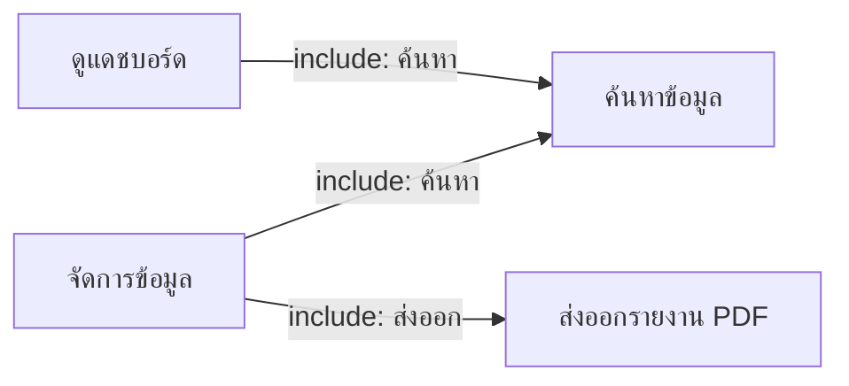

# Use Case Diagram - ระบบบันทึกเวลาเรียนของนักศึกษา

## ภาพรวมของระบบ

```mermaid
graph TB
    subgraph System["📚 ระบบบันทึกเวลาเรียนนักศึกษา"]
        UC1["เข้าสู่ระบบ/ออกระบบ"]
        UC2["อัปเดตโปรไฟล์"]
        UC3["เปลี่ยนรหัสผ่าน"]
        UC4["บันทึกเวลาเข้าห้องเรียน"]
        UC5["เรียกดูรายวิชา"]
        UC6["จัดการข้อมูลนักศึกษา"]
        UC7["ค้นหาข้อมูล"]
        UC8["ส่งออกรายงาน PDF"]
        UC9["ดูตารางเรียน/สอน"]
        UC10["ส่งข้อความ"]
        UC11["แดชบอร์ดสรุปผล"]
        UC12["จัดการบัญชีผู้ใช้"]
        UC13["จัดการภาคเรียน"]
        UC14["จัดการห้องเรียน"]
        UC15["จัดการรายวิชา"]
    end
    
    Actor1["👨‍🏫 อาจารย์"]
    Actor2["👨‍🎓 นักศึกษา"]
    Actor3["👨‍💼 ผู้ดูแลระบบ"]
    
    Actor1 -->|ใช้งาน| UC1
    Actor1 -->|ใช้งาน| UC2
    Actor1 -->|ใช้งาน| UC3
    Actor1 -->|ใช้งาน| UC4
    Actor1 -->|ใช้งาน| UC5
    Actor1 -->|ใช้งาน| UC6
    Actor1 -->|ใช้งาน| UC7
    Actor1 -->|ใช้งาน| UC8
    Actor1 -->|ใช้งาน| UC9
    Actor1 -->|ใช้งาน| UC10
    
    Actor2 -->|ใช้งาน| UC1
    Actor2 -->|ใช้งาน| UC2
    Actor2 -->|ใช้งาน| UC3
    Actor2 -->|ใช้งาน| UC11
    Actor2 -->|ใช้งาน| UC8
    Actor2 -->|ใช้งาน| UC9
    Actor2 -->|ใช้งาน| UC10
    
    Actor3 -->|ใช้งาน| UC1
    Actor3 -->|ใช้งาน| UC2
    Actor3 -->|ใช้งาน| UC3
    Actor3 -->|ใช้งาน| UC11
    Actor3 -->|ใช้งาน| UC12
    Actor3 -->|ใช้งาน| UC13
    Actor3 -->|ใช้งาน| UC14
    Actor3 -->|ใช้งาน| UC15
    Actor3 -->|ใช้งาน| UC9
    Actor3 -->|ใช้งาน| UC8
    Actor3 -->|ใช้งาน| UC7
```

---

## ฟังก์ชั่นการทำงานรายละเอียด

### 👨‍🏫 1. อาจารย์ (Instructor)

| ลำดับที่ | Use Case | รายละเอียด |
|---------|----------|-----------|
| 1.1 | เข้าสู่ระบบ/ออกระบบ | อาจารย์สามารถเข้าสู่ระบบด้วยชื่อผู้ใช้และรหัสผ่าน และออกจากระบบได้ |
| 1.2 | อัปเดตโปรไฟล์ | แก้ไขข้อมูลส่วนตัวเช่น อีเมล เบอร์โทรศัพท์ เป็นต้น |
| 1.3 | เปลี่ยนรหัสผ่าน | อัปเดตรหัสผ่านสำหรับการเข้าสู่ระบบ |
| 1.4 | บันทึกเวลาเข้าห้องเรียน | บันทึกเวลาเข้าห้องเรียนของนักศึกษาในรายวิชา |
| 1.5 | เรียกดูรายวิชาที่สอน | ดูรายชื่อวิชาที่ตนเองสอนในภาคเรียนปัจจุบัน |
| 1.6 | จัดการข้อมูลนักศึกษา | บันทึก แก้ไข ลบ ค้นหาข้อมูลนักศึกษาในรายวิชา |
| 1.7 | ค้นหาข้อมูล | ค้นหาข้อมูลนักศึกษาและรายวิชา |
| 1.8 | ส่งออกรายงาน PDF | ส่งออกรายงานสรุปผลการเข้าเรียนเป็น PDF |
| 1.9 | ดูตารางสอน | ดูตารางสอนของตนเอง |
| 1.10 | ส่งข้อความตอบกลับ | ส่งข้อความตอบกลับถึงนักศึกษา |

### 👨‍🎓 2. นักศึกษา (Student)

| ลำดับที่ | Use Case | รายละเอียด |
|---------|----------|-----------|
| 2.1 | เข้าสู่ระบบ/ออกระบบ | นักศึกษาสามารถเข้าสู่ระบบด้วยชื่อผู้ใช้และรหัสผ่าน และออกจากระบบได้ |
| 2.2 | อัปเดตโปรไฟล์ | แก้ไขข้อมูลส่วนตัว เช่น อีเมล เบอร์โทรศัพท์ เป็นต้น |
| 2.3 | เปลี่ยนรหัสผ่าน | อัปเดตรหัสผ่านสำหรับการเข้าสู่ระบบ |
| 2.4 | แดชบอร์ดสรุปผล | ดูสรุปผลการเข้าห้องเรียน เช่น จำนวนครั้งที่มา ขาด สาย |
| 2.5 | ส่งออกรายงาน PDF | ส่งออกรายงานสรุปผลการเข้าเรียนเป็น PDF |
| 2.6 | ดูตารางเรียน | ดูตารางเรียนของตนเอง |
| 2.7 | ส่งข้อความถึงอาจารย์ | ส่งข้อความถึงอาจารย์ผู้สอน |

### 👨‍💼 3. ผู้ดูแลระบบ (Administrator)

| ลำดับที่ | Use Case | รายละเอียด |
|---------|----------|-----------|
| 3.1 | เข้าสู่ระบบ/ออกระบบ | ผู้ดูแลระบบสามารถเข้าสู่ระบบด้วยชื่อผู้ใช้และรหัสผ่าน และออกจากระบบได้ |
| 3.2 | อัปเดตโปรไฟล์ | แก้ไขข้อมูลส่วนตัว |
| 3.3 | เปลี่ยนรหัสผ่าน | อัปเดตรหัสผ่านสำหรับการเข้าสู่ระบบ |
| 3.4 | แดชบอร์ดสรุปข้อมูล | สรุปข้อมูลการเข้าเรียน การขาดเรียน เวลาเรียน |
| 3.5 | จัดการบัญชีผู้ใช้ | บันทึก แก้ไข ลบ ค้นหาข้อมูลบัญชีผู้ใช้ |
| 3.6 | จัดการข้อมูลภาคเรียน | บันทึก แก้ไข ลบ ค้นหาข้อมูลภาคเรียน |
| 3.7 | จัดการข้อมูลห้องเรียน | บันทึก แก้ไข ลบ ค้นหาข้อมูลห้องเรียน |
| 3.8 | จัดการข้อมูลรายวิชา | บันทึก แก้ไข ลบ ค้นหาข้อมูลรายวิชา |
| 3.9 | จัดการข้อมูลนักศึกษา | บันทึก แก้ไข ลบ ค้นหาข้อมูลนักศึกษา |
| 3.10 | จัดการตารางเรียน/สอน | ตั้งค่าและจัดการตารางเรียน/สอน |
| 3.11 | ส่งออกรายงาน | ส่งออกรายงาน PDF ต่างๆ |
| 3.12 | ค้นหาข้อมูล | ค้นหา ข้อมูลต่างๆ ในระบบ |

---

## ความสัมพันธ์ระหว่าง Use Cases

### ฟังก์ชั่นภายนอก (Extend/Include)

---

## หลักการออกแบบ (Design Principles)

1. **Authentication**: ทุก Actor ต้องเข้าสู่ระบบก่อน
2. **Authorization**: แต่ละ Actor มีสิทธิ์ที่แตกต่างกัน
3. **Data Management**: CRUD Operations (Create, Read, Update, Delete)
4. **Reporting**: ส่งออกข้อมูลเป็น PDF
5. **Communication**: ระบบข้อความระหว่าง Actors

---

**สร้างเมื่อ**: 11 กุมภาพันธ์ 2026
**ระบบ**: ระบบบันทึกเวลาเรียนของนักศึกษา
